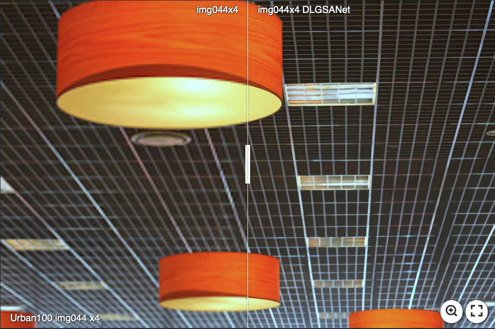
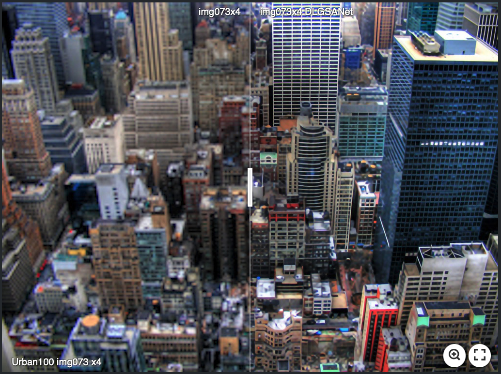
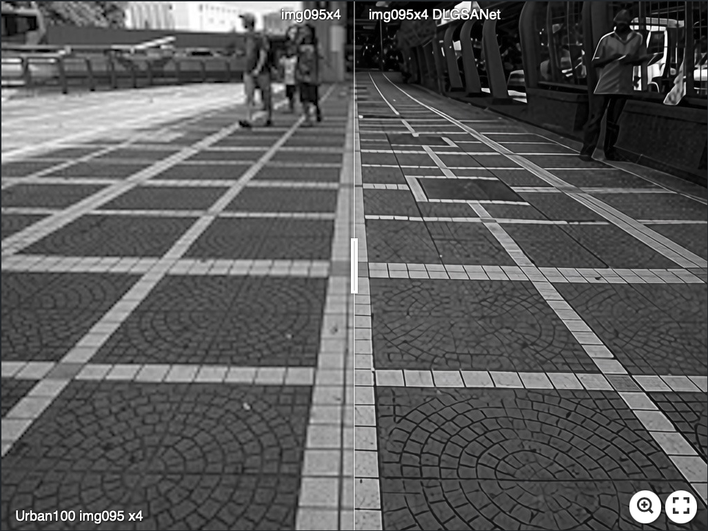

# DLGSANet: Lightweight Dynamic Local and Global Self-Attention Networks for Image Super-Resolution

### [Project Page](https://neonleexiang.github.io/DLGSANet/) | [Paper (ArXiv)](https://arxiv.org/abs/2301.02031) | [Supplemental Material]()

**This repository is the official pytorch implementation of our paper, *DLGSANet: Lightweight Dynamic Local and Global Self-Attention Networks for Image Super-Resolution*.**

[Xiang Li](https://imag-njust.net/)<sup>1</sup>,
[Jinshan Pan](https://jspan.github.io/)<sup>1</sup>,
[Jinhui Tang](https://imag-njust.net/jinhui-tang/)<sup>1</sup>,
[Jiangxin Dong](https://imag-njust.net/jiangxin-dong/)<sup>1</sup> <br>

<sup>1</sup>[IMAG Lab](https://imag-njust.net/), Nanjing University of Science and Technology

> Abstract: We propose an effective lightweight dynamic local and global self-attention network (DLGSANet) to solve image super-resolution. Our method explores the properties of Transformers while having low computational costs. Motivated by the network designs of Transformers, we develop a simple yet effective multi-head dynamic local self-attention (MHDLSA) module to extract local features efficiently. In addition, we note that existing Transformers usually explore all similarities of the tokens between the queries and keys for the feature aggregation. However, not all the tokens from the queries are relevant to those in keys, using all the similarities does not effectively facilitate the high-resolution image reconstruction. To overcome this problem, we develop a sparse global self-attention (SparseGSA) module to select the most useful similarity values so that the most useful global features can be better utilized for the high-resolution image reconstruction. We develop a hybrid dynamic-Transformer block(HDTB) that integrates the MHDLSA and SparseGSA for both local and global feature exploration. To ease the network training, we formulate the HDTBs into a residual hybrid dynamic-Transformer group (RHDTG). By embedding the RHDTGs into an end-to-end trainable network, we show that our proposed method has fewer network parameters and lower computational costs while achieving competitive performance against state-of-the-art ones in terms of accuracy.

## Framework


---
## Contents

The contents of this repository are as follows:

1. [Dependencies](#Dependencies)
2. [Train](#Train)
3. [Test](#Test)

### Dependencies

> - Python
> - Pytorch (1.11 or 1.13)
> - basicsr
> - cupy-cuda

extra infos: 
> - [BasicSR](https://github.com/XPixelGroup/BasicSR)
> - [cupy](https://github.com/cupy/cupy)

For more details of the dependencies, please refer to `requirements.txt`

### Train

```
# For X2
sh ./demo_sbatch_file/SISR_ClassicDIV2K/train_SISR_ClassicDIV2K_Large_90C6G4B_DLGSANet_SRx2_scratch_img_size_48_lr5e_4.sh

# For X3
sh ./demo_sbatch_file/SISR_ClassicDIV2K/train_SISR_ClassicDIV2K_Large_90C6G4B_DLGSANet_SRx3_scratch_img_size_48_lr5e_4.sh

# For X4
sh ./demo_sbatch_file/SISR_ClassicDIV2K/train_SISR_ClassicDIV2K_Large_90C6G4B_DLGSANet_SRx4_scratch_img_size_48_lr5e_4.sh
```

### Test

```
# For X2
sh ./demo_sbatch_file/SISR_ClassicDIV2K/test_SISR_ClassicDIV2K_Large_90C6G4B_DLGSANet_SRx2_scratch_img_size_48_lr5e_4.sh

# For X3
sh ./demo_sbatch_file/SISR_ClassicDIV2K/test_SISR_ClassicDIV2K_Large_90C6G4B_DLGSANet_SRx3_scratch_img_size_48_lr5e_4.sh

# For X4
sh ./demo_sbatch_file/SISR_ClassicDIV2K/test_SISR_ClassicDIV2K_Large_90C6G4B_DLGSANet_SRx4_scratch_img_size_48_lr5e_4.sh

```

---


## Visual Results








---


## To Do

Release pre-trained models of regular models

Release the visual results of BI super-resolution


## Citation
If this work is helpful for your research, please consider citing the following BibTeX entry.
```
 @article{li2023dlgsanet,
      title={DLGSANet: Lightweight Dynamic Local and Global Self-Attention Networks for Image Super-Resolution}, 
      author={Li, Xiang and Pan, Jinshan and Tang, Jinhui and Dong, Jiangxin},
      journal={arXiv preprint arXiv:2301.02031},
      year={2023},
}
```

## Acknowledgement

The foundation for the training process is [BasicSR](https://github.com/XPixelGroup/BasicSR) , which profited from the outstanding contribution of [XPixelGroup](https://github.com/XPixelGroup) .

The following research forms the foundation for the MHDLSA implementation:

On the Connection between Local Attention and Dynamic Depth-wise Convolution [paper](https://arxiv.org/abs/2106.04263) [github](https://github.com/Atten4Vis/DemystifyLocalViT)

And the following research forms the foundation for the SparseGSA implementation:

Restormer: Efficient Transformer for High-Resolution Image Restoration [paper](https://arxiv.org/abs/2111.09881) [github](https://github.com/swz30/Restormer)

Improving Image Restoration by Revisiting Global Information Aggregation [paper](https://arxiv.org/abs/2112.04491) [github](https://github.com/megvii-research/TLC)


## Contact

This repo is currently maintained by Xiang Li ([@neonleexiang](https://github.com/NeonLeexiang)) and is for academic research use only. 
